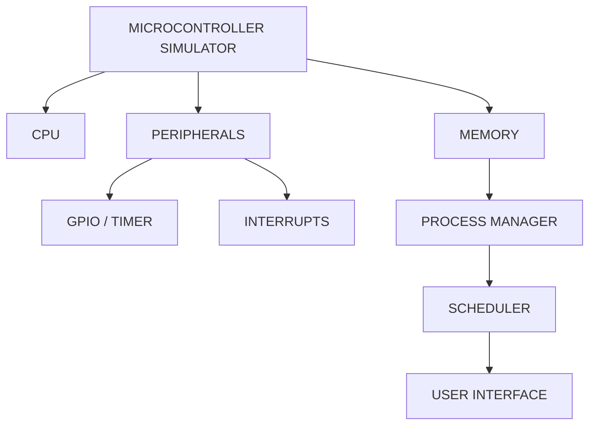

# PIC16F72 Microcontroller Simulator

## Problem Objective
To design and implement a software-based simulator for the PIC16F72 8-bit microcontroller that
replicates its core CPU behavior, memory organization, and key peripherals (GPIO, Timer0,
interrupts) closely enough to run and visualize simple assembled programs.

## Problem Statement
"Students and hobbyists working with the PIC16F72 
often lack an accessible way to trace instruction execution and peripheral state without physical
hardware. This project builds a simulator that lets a user load a program, step through execution,
and observe registers/memory/peripherals changing in real time."

## Project Scope
- In scope: CPU instruction execution, register/memory model, stack mechanism, Timer0, GPIO
  (PORTA/B/C + TRIS), interrupt handling, a basic UI to load and step through programs.
- Out of scope (Week 1): full peripheral set (ADC, SPI/I2C, USART), cycle-accurate timing,
  real hardware programming/flashing.

## Microcontroller Being Simulated
Microchip PIC16F72 — 28-pin, 8-bit CMOS FLASH microcontroller, mid-range PIC architecture,
35-instruction instruction set. Reference: Microchip datasheet DS39597C.

## Team Members & Responsibilities

| Member | Role | Primary Responsibility | Supporting Responsibility |
|---|---|---|---|
| Mohammed Ayman | Team Leader | CPU & Instruction Execution | Integration & GitHub |
| Mohammed Shayaan | Member | Memory & Stack | CPU support |
| Sancia | Member | Data Structures & Process Management | Testing |
| Prakrithi | Member | OS Scheduling & Context Switching | UI & Integration |

## Selected Programming Language
**Java**

- Reason for selection: strong OOP support for modeling CPU/memory/peripherals as
  objects, team familiarity, cross-platform, good tooling
- Advantages for this project: clear class modeling of registers/memory banks, mature
  ecosystem, easy to build a simple UI (Swing/JavaFX)
- Limitations: performance overhead vs. C for cycle-accurate simulation — acceptable since
  this is a functional, not timing-accurate, simulator

## Initial System Architecture

(Initial design — will be refined in later weeks.)

## Initial Development Plan
- Week 1: Team formation, repo setup, PIC16F72 architecture study, language finalization,
  initial design.
- Week 2: CPU core / instruction execution.
- Week 3+: Memory & stack, GPIO/Timer0, interrupts, scheduler, UI — fill in as the
  team plans further.
